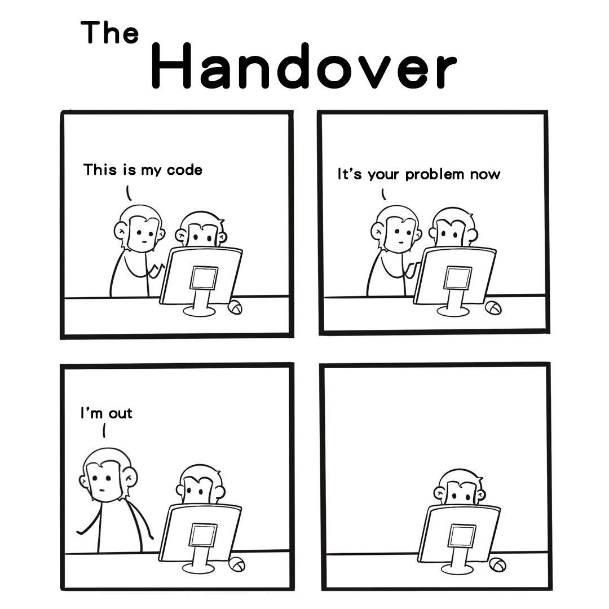

## Introduction
The roles of software engineers are not to just shut yourself to your desk all day and code… it might be in some cases.
  But, a key part of the work you will encounter is consulting with clients, coworkers, and possibly partner companies to ensure you are meeting all the design specifications of what you are building and all share the same view. Ensuring that so many different parties are on the same page requires communication skills, so a key skill we must develop as future software engineers is our ability to communicate clearly and effectively. On the internet, there are tons of forums and social media where people can post about their life and their own perspectives on specific topics. With forums in particular, and I have one in mind, to effectively facilitate discussions, the original prompts must follow certain guidelines. We will take a look at one of the biggest programming-related forums in the world, stack overflow.

## Smart Questions
Smart questions, as deemed by Eric S. Raymond, should follow a similar structure to that of a good science experiment. Provide ample background and context to your problem, have your problem be specific and reproducible, reference existing resources, and follow standard formatting. One example of a smart question can be found at this [link](https://stackoverflow.com/questions/37470349/clojure-filtering-a-vector-of-maps-by-keys-existence-and-values). 
This user was struggling with designing a function in clojure that filters a vector of maps by specific tags and values, providing an example map of that type and their attempt of creating the filter function. They gave a specific example of their desired filter process in their explanation with expected results and mentions they are struggling to grasp the recursive loop approach to filter maps. The example code snippets were also formatted inside a code box. This user provided proper background and code to reproduce the problem and is perceived to have done their own research, mentioning he is “failing to grasp” the recursive approach, and was very considerate throughout his post. 

Expectedly, someone provided a walkthrough with explanations of two different approaches to the problem the original poster was facing. The walkthrough provide code snippets of an outline of each solution, incrementally introducing each section of the function for the original problem and able to do so thanks to the original poster’s thoroughness in describing their situation.

## Bad Questions
Bad questions, intuitively, have the opposite qualities of a smart question. To list it out, the question provides little to no or too much background information about their problem, the question itself being broad and lacking specific details, or being demanding or aggressive. One example of a bad question can be found at this [link](https://stackoverflow.com/questions/78977067/can-anybody-solve-this-coding-questions). 
This user was requesting help with a python coding question and unwisely posted the entire coding problem background and prompt, presumably copy pasted from some document, and the outline of code provided for the coding question with “Answer this question” under the code block, further giving the impression that this is from a coding class assignment. The coding problem itself looks to design a function that takes in a document and words list, and return true or false whether that document can be generated with  the supplied words list. 

While they did do one thing right in formatting the code in a code block, they failed to provide concise details that would be easy for others to read and understand the problem in a short time. I wasn’t even able to keep my focus trying to read through the entire post. Also, the original poster appeared to not even try to attempt the problem themselves first, which if you did not bother to take the time to attempt the problem how do you know you are struggling with the problem? These forums are not chegg. Overall, the notion of asking the users of stack overflow to just “solve this coding question” is incredibly looked down upon as it does not foster discussion and learning about related technical elements.  
Because of all the aforementioned, the question received negative votes and was closed by a moderator for being too broad. Posting a full coding problem broke some posting guidelines while he did provide ample information, expecting the community to solve your entire coding assignment is frowned upon.

