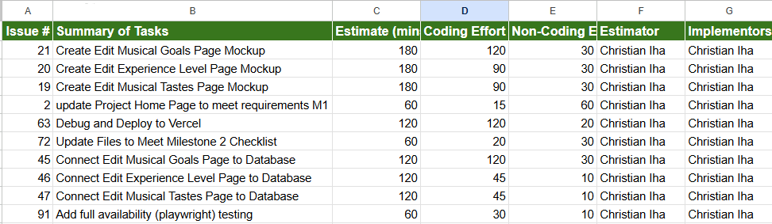
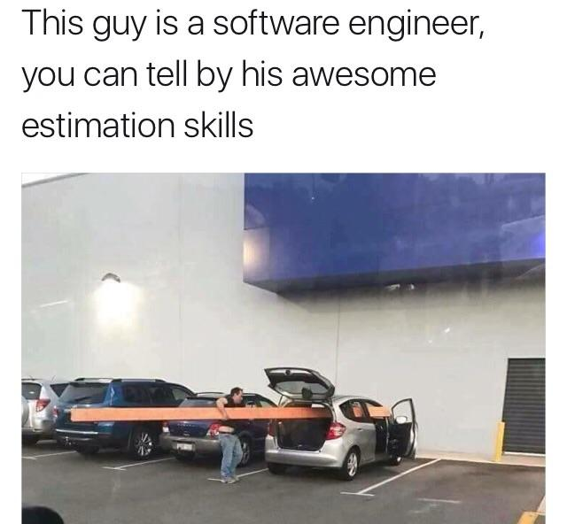

## Introduction

When it comes to still learning how to software develop, tracking how long something takes you is something that is often avoided, for a variety of reasons. One of the main reasons being overestimating your own abilities, especially at the beginner level, but other reasons include needing to reference existing code online to avoid design or syntax errors and simply put learning how to code is extremely difficult. One of the big shots I took when I estimated and tracked my project effort was definitely the first reason though.

 

## Approach to Effort Estimation

My approach to estimating how long something will take me was probably incorrect looking back at it now, as we were supposed to track non-coding effort and coding-effort. I spent a decent amount of time before coding just looking and thinking of how would I implement the code related to my issue, which would count as non-coding effort, so my estimations were definitely offset by a set amount. If I were to include the initial 15-30 minutes in my estimations then my estimations would, from a design approach, be more accurate. So besides that little error, I would base my estimations on contextualizing my experiences and the task at hand. I would first try to come up with a solution approach then use my previous experiences coding something with a similar approach to make an educated guess on how each issue would take me.

 

## Results

Let's talk about how accurate my estimation were so I can provide further insight on my approach to estimating. My estimations were split into three different categories: ~10 minutes within my actual effort-hours, way shorter than my actual-effort hours, or way longer than my actual effort-hours. For example, the first issue I worked on was issue 21 where I had put an estimate of 180 and a combined effort (coding and non-coding) of 150. One issue that I got unexpectedly stuck on for a really longer time, one of the later issues (issue 45), took 210 minutes where my estimate was 120 minutes. On the issues I worked on before that I overestimated how long it would take me by an hour.

  

 

For tracking the actual amount of effort I put into the project, I would first isolate a 2 hour section of time (less if the estimation was ~60 minutes or less) towards completing the issue, start a Google timer as soon as I get my tools set up -- including the GitHub organization page and the Visual Studio Code, as well as note down the time that I started working. I would typically work until I completed the task and that way would not have to add up times from multiple sessions, making it easier to track using an external service, such as a Google timer. After committing the code, I would also compare the final commit time to the time that I noted done when I started, acting as secondary verification though this only applied to issues I completed in one session.

 

## Reflect

  

I believe estimating and tracking the effort I put into a programming project can be extremely beneficial for myself, as it provides statistics related to my performance in coding with respect to where I believe my performance I would be at. Even if my estimations were inaccurate, knowing the specific issues where I over- or underestimated the difficulty of the task or the proficiency of my skills helps me to reflect on where I truly am at with software engineering. I believe having both estimations and tracking them are essential to make any benefit from them however. Estimates before attempting a programming problem will be based on your interpretation of the combination of the problem specifications and your skill level, which being able to accurately evaluate the difficulty of a task and being aware of one's skill level are both important to be able to perform.

Tracking the actual effort expended on the issue contribute to the same benefits which estimation brings. After completing an issue, it allows one to reflect on their coding efficiency and puts an emphasis on tasks that were a struggle or a breeze. Knowing for sure that you had difficulty with coding something and reflecting on those exact moments helps with internalizing those experiences to avoid those issues in the future. Acknowledging that something took you longer than you expected should not be a reason for you to avoid tracking how long tasks take you in the future, and instead you should feel solace in knowing exactly how you performed and that you now have to ability reflect and learn from that experience.

