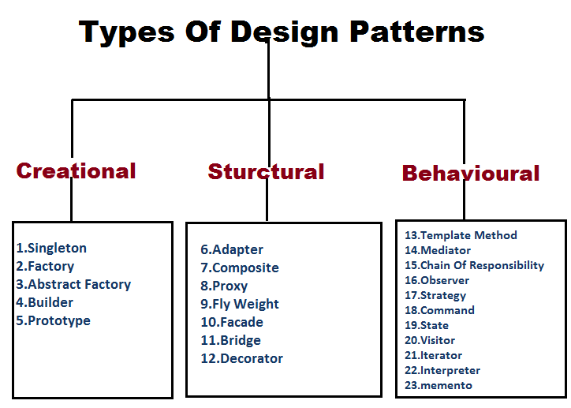

## Introduction

In software development, creating efficient, scalable, and maintainable code is a constant challenge, no matter where you are in your software developer career. Many of the habits taught to and maintained by ourselves will serve as reusable solutions to common software design problems, which nearly all programming problems can be simplified down to with the proper approach.
 
 
What may come to surprise developing software engineers are that many of the techniques they frequently employ by practice are commonly used by many software engineers and are recognized as <b>design patterns</b>. By adopting design patterns, individual and teams of developers can standardize their approach, improve communication, and streamline the development process. And numerous design patterns are not bound by programming languages, making them a versatile tool in any developer's kit.
 
 
Even for myself, I had not recognized how many design patterns I had picked up during my programming WOD's (Workout of the Day) and implemented into a final project for ICS 314 -- a culmination of all the concepts learned during that class. Even more general design approaches I had picked up in learning C, C++, and Java in the years before and seamlessly applied to JavaScript and TypeScript; I did not expect those techniques, deviating from the standardized design patterns slightly as I had picked them up naturally, to also be a part of my tool set.

 

## Design Patterns

#### <u>Definition and Examples</u>

Design patterns are standardized reusable solutions to common problems in software design. Design patterns encapsulate the best practices and provide a template for solving routine software development challenges in a way that is effective while curating to a wide audience of developers from newbies to professionals, allowing any software developer to implement those techniques. Utilizing design patterns will result in the swift development of code that is easily comprehensible, for both the original and additional developers, that can be applied to many different problems, reducing redundancy.
 
 
<b>Design patterns can classified into three main categories:</b>
 
<b>Creational Patterns</b> – Focuses on object creation mechanisms, where functionality of code is independent of how its objects are created, composed, or represented. This approach focuses on designing objects for the specific problem while reducing complexity or redundancy.
 
<b>Structural Patterns</b> – Deals with the composition of classes or objects, with the aims of utilizing inheritance and interfaces (between classes and/or objects) to form a larger structure for the entire system which is efficient and flexible.
 
<b>Behavioral Patterns</b> – Addresses communication between objects, relating to how to design a collaborative system handler that distributes responsibilities between objects to support and manage more complex systems.
 

 
By leveraging these design patterns, developers can avoid reinventing the wheel and create more robust and maintainable code. You can read more about these patterns <a href="https://www.geeksforgeeks.org/software-design-patterns/#types-of-software-design-patterns">here</a>
 

 

#### <u>Applications in ICS314</u>

At the time I am writing this essay, my ICS 314 final project group just met our 2nd milestone or key checkpoint, and at this checkpoint we were expected to connect some of our website pages to a database with reading and writing capabilities incorporated on our website. I was able to implement reading and writing functionality on my page, known as the "Edit Goals" page, which is only available to system admins and edits the goals users will be able to chose from to put under their profile, such as "Learn to play a new musical instrument." 
 
 
With context out of the way, I will now explain a couple of design patterns that are present in the code of just this singular file of code. 
 
 

<b>Container/Presentational Pattern</b>

<pre class="highlight"><code>/* Container Component */
const EditGoalsForm = () =&gt; {
  // State and logic here
  return (
    &lt;Container&gt;
      {/* Presentational components */}
    &lt;/Container&gt;
  );
};
</code></pre>

<pre class="highlight"><code>/* Presentational Component */
const GoalRow = ({ goal, onSave, onEdit }) =&gt; (
  &lt;tr&gt;
    &lt;td&gt;{goal.isEditing ? &lt;FormControl ... /&gt; : goal.goal}&lt;/td&gt;
    &lt;td&gt;
      {goal.isEditing ? (
        &lt;Button onClick={() =&gt; onSave(goal)}&gt;Save&lt;/Button&gt;
      ) : (
        &lt;Button onClick={() =&gt; onEdit(goal)}&gt;Edit&lt;/Button&gt;
      )}
    &lt;/td&gt;
  &lt;/tr&gt;
);
</code></pre>

 

The code snippets above depicts an example of a Container/Presentational design pattern in a next component designed by myself. The code for this same component will be used in following examples. This design pattern enforces a separation of concerns -- simplifying a programming problem -- by using separate components to display data to the user and how to display data to the user. 
 
 
The code for this next component has a return statement in the <i>Container Component</i> of the design pattern which is used to display information on the actual "Edit Goals" page mentioned before, that information being the contents of the return statement. In the <i>Presentational Component</i>, a different button (that being the data), will show depending on whether the goal is being edited or not. 
 
 

<b>Higher-Order Component (HOC) Pattern</b>

 

<pre class="highlight"><code>/* 
 * HOC Component 
 * File Location: @/lib/dbActions.ts
 */

export async function editGoal(goal: {
  id: number;
  goal: string;
  isEditing: number;
}) {
  // Update the database
  await prisma.goals.update({
    where: { id: goal.id },
    data: {
      goal: goal.goal,
      isEditing: goal.isEditing,
    },
  });
}
</code></pre>

<pre class="highlight"><code>/* Edit Goals Component */
'use client';

import { editGoal } from '@/lib/dbActions';
  .
  .
  .
const enableEdit = async (goal: Goals) =&gt; {
  const updatedGoal = { ...goal, isEditing: 1 };
  await editGoal(updatedGoal); // Calls HOC
  window.location.reload();
};

const saveGoal = async (goal: Goals) =&gt; {
  const updatedGoal = { ...goal, isEditing: 0 };
  await editGoal(updatedGoal); // Calls HOC
  window.location.reload();
};
  .
  .
  .
  &lt;Button variant="success" className="me-2" onClick={() =&gt; saveGoal(goal)}&gt;
    Save
  &lt;/Button&gt;
  &lt;Button variant="primary" className="me-2" onClick={() =&gt; enableEdit(goal)}&gt;
    Edit
  &lt;/Button&gt;
</code></pre>

 

The code snippets above depicts an example of a Higher-Order Component (HOC) design pattern. This design pattern reduces redundancy -- allow multiple components to also use that logic without redefining the logic -- by defining said logic, the editGoal function, as a different component in another file. This also helps in making the code more readable by passing functions to child components which handle very specific tasks.
 
 
The <i>HOC Component </i> is defined in a separate file, alongside other functions that can edit database data, and is passed the goal object to be edited. In the next component code, the HOC is referenced and passed an updated goal parameter which contains the updated <i>isEditing</i> and <i>goal</i> values (the goal value being the text of the goal). In this implementation, all client sided changes are handled by the next component code and the database changes are handled by the HOC. This change was also necessary as prisma must run in an asynchronous environment, whereas the client-sided changes require a "use client" page, therefore that separation of functions was needed.
 
 

## Future Thoughts

Though design patterns were not something I consciously implemented into my coding environment, both of the examples in my code being that case, I think they are extremely valuable to follow. From the novice level, which is where I believe I am in most cases, I think design patterns can guide you to optimizing your programming by teaching you the best practices from the start while explaining the reasoning in a beginner-friendly manner. And at any level, I believe following design pattern will lead to improved coding efficiency and readability, as the patterns are what they advertise: standardized reusable solutions.

