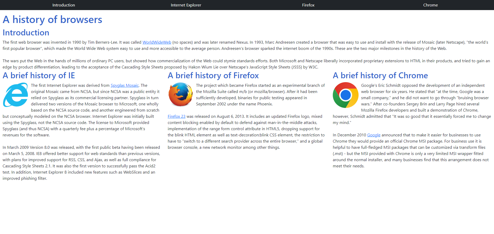

## Introduction
<p>

<b>Is it worth it to elevate your full stack development skills to a high-proficiency?</b> Taking into consideration the time-in and pay-out it of becoming a professional in full stack development – as it seems from a newbie in the field – it does not really look like it would be a worthy investment, given how much time it takes to master one language for just either frontend or backend. 
<br>
<br>
This could be different for those studying software engineering with a set field that they <i>know</i> they want to work in. However, I feel many college students pursuing a software engineering or related degree were interested in a certain aspect of tech from a young age such as video games, web development, robotics, security, and so on (or just in the field for the money). And then we get into college and a bunch has changed:  The tech world has evolved around us and our initial interest may not be sustainable, we learned of toxic workplace cultures and practices that plague certain markets, we learned how difficult it really is to learn coding, and so much more that changes over time.
<br>
<br>
Left to reconsider what it is we'd truly like to pursue as a career, it is truly difficult to weigh the importance of and effort one should put into developing a skill when there's no tool belt to combine these skills into something cohesive and profitable. <b>Learning UI frameworks</b> being nothing shy of that.
</p>

## My Experience

#### <u>Simple Web Designs</u>

<p align="center">

<br>
<b><i>Bootstrap, Bootstrap on the web, what's the best to learn to dev?</i></b>
</p>

<p>

I can say, from a beginner standpoint, bootstrap is amazing for quickly developing and learning how to develop websites. Much easier than using raw html and css simply because of all the pre-built components and systems that bootstrap adds on top of html for web design. For example, using bootstrap saves a lot of time with building a simple website such as one on the history of browsers or cloning a prototype of websites found online such as Island Snow (at https://islandsnow.com/), my renditions shown on the images below. Also below is an example code snippet from the browser history web page I designed utilizing the bootstrap grid system to much easily format the website than the previous design which used only css styling.
<br>
</p>
<p align=center>

</p>

```css
<section class="row" id="browsers">
  <div class="col">
      <h2 id="ie">A brief history of IE</h2>
      .
      .
      .
  </div>
  <div class="col">
      <h2 id="firefox">A brief history of Firefox</h2>
      .
      .
      .
  </div>
  <div class="col">
      <h2 id="chrome">A brief history of Chrome</h2>
      .
      .
      .
  </div>
</section>
```

#### <u>Complex Website Elements</u>
<p>

Though bootstrap does bring ease of use for those simpler website designs, when it came to recreating a website of <u>my choice</u>, without any help from the professor as with the two previously mentioned web designs, I found those same features of bootstrap to be limiting when it came to finer or higher-level details. A prime example of this is one of the dropdown menus of the navigation menu for bitwarden (at https://bitwarden.com/).
<br>
<br>
The real website had a horizontal dropdown menu that overall just looked fancy and heavily customized, as shown on the first image below. I tried my best to abstract the menu so I could implement it using just bootstrap: the menu goes until the margins at the sides of the page, there are three columns each with a header, a paragraph, and containers which contain text and redirect the user on click, and underneath all that a footer with more links. This may have just been due to my lack of knowledge of bootstrap, but I was not able to find a way to widen the dropdown menu element of bootstrap to the specifications of the real site or even widen it much it all, making the columns I defined way to crammed with overlapping text, could not figure out how to add those containers with lighter backgrounds at the bottom of each column. My final website design is shown after the image of the original website.
<br>
</p>
<p align="center">
 
</p>
<p>
Overall, it seems <b>the component that bootstrap had implemented to simplify my design workflow was actually inhibiting it</b> and I ended opting out of making the columned-dropdown-menu and just listed the different sections vertically in my replication. As I mentioned before, there may have been a way to implement the original menu design using bootstrap that I simply did not know of, but the benefits of bootstrap that I pointed out before cater towards quickly developing and learning how to develop websites.
<br>
<br>
Though I was able to replicate the rest of the bitwarden website with relative ease, as there was little nesting of bootstrap components or other kind of element depth, my failure to implement that one dropdown menu is what stuck with me of that exercise. And that left me to believe that while bootstrap was helpful for simple formatting and prototyping of a website, when it comes to a website design that requires more depth and customizability than bootstrap provides by default, it is most likely better to learn to implement said design elements using css styling with html.
</p>

## Future Thoughts
So, going back to the time-in pay-out perspective I mentioned at the beginning of this essay, I think it isn't worth it to put all your time into mastering a UI Framework such as bootstrap. Do I think it's a helpful tool that one can use in the path of mastering some other skill like html or React <i>(foreshadowing...)</i>. Definitely! Though I may be learning frontend development because the curriculum of my class says to and not because it's something I'm deeply interested in, it is inevitably something I will have to suck up and learn, just like many other skills and languages my future work will require of me, since I'm also not sure of what field I want to work in. Being able to evaluate and reflect on these skills, while not being masters of them, will be a valuable skill in itself that I learned of to effectively divide my time towards developing my skillset in the future.