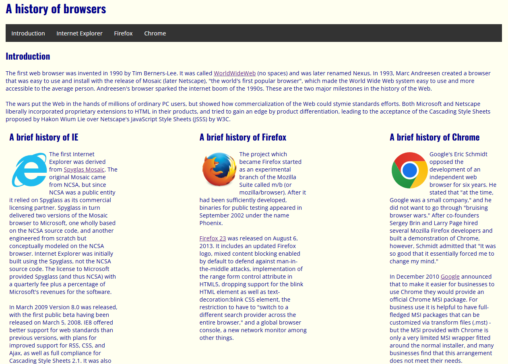
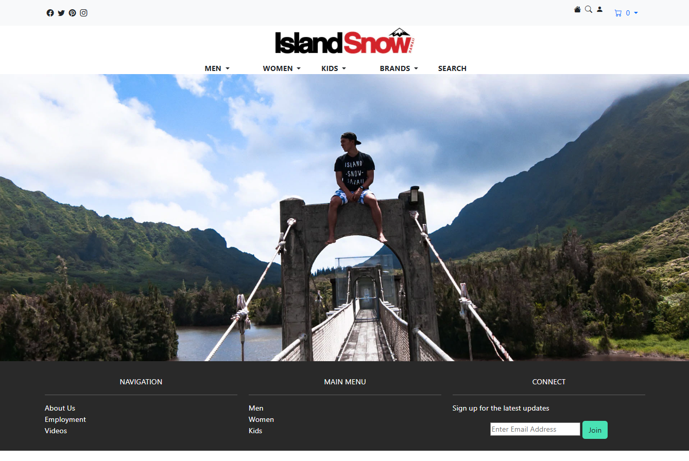
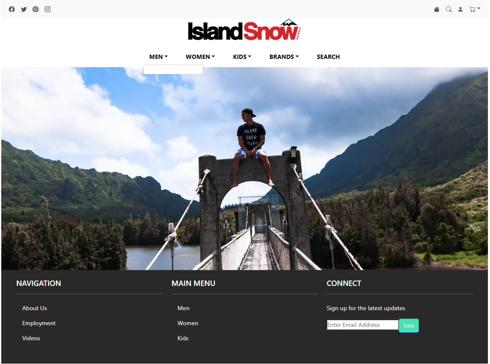
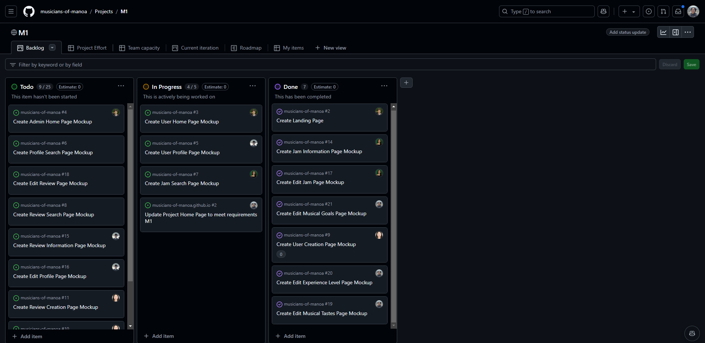

## Introduction

Nearing the end of my Software Engineering I class, ICS 314, and bringing a close to my 5th semester of pursuing a bachelor's degree in computer engineering, it's time to reflect on the skills I gained and what they really represent in my future in software development. The core focus of ICS 314 at the University of Hawaii at Manoa was to develop technical skills with respect to web development, which the technology stack provided a solid foundation for, the real applications of this class extend much further than that. The real applications of this class can be found in any upcoming problems I will encounter in my future career in this field.
 
 
In this essay, I will reflect on my experiences working with User Interface Frameworks, Agile Project Management, and Open Source Software Development, and how these topics will contribute to my programming tool set.

 

## User Interface Frameworks

<i>User Interface Frameworks</i> (UI Frameworks), refer to a collection of tools, libraries, and templates coordinated into a single software to help developers create user interfaces for web or mobile applications. The components of these softwares heavily optimize the process of web development, and learning of which, by providing a standardized, heavily documented, and reusable environment to web developers. The UI Frameworks used in this class included Bootstrap and React.

  
  
  

  At a reasonable level, the most students at the time could achieve with html is shown in the first image, compared to bootstrap in the second image, compared to react in the third image. React allowed for easier customizability of spacing, text formatting, and implementation of components (such as the actually functioning dropdown) as they are built into React.

In this class, we started our journey in web development in raw html and css, then moved onto integrating bootstrap elements into our website code -- replacing the need for html and css, and finally graduated onto using React -- reducing the depth of the website code by replacing bootstrap elements, providing methods to reuse code, and allowing server/client communication. The experiences/assignments of the ICS 314 class had us implement similar components across multiple different website designs, allowing us to go through repetitive design alongside the use of UI frameworks, the design getting easier to implement with each new framework.

Beyond web applications, the importance of documentation for collaboration, of flexible reusable code for time-efficient coding, and of use of tools/libraries that cater towards your design for streamlining your development,  are amongst the implications that UI frameworks bring to any programming project 

 

## Agile Project Management

<i>Agile Project Management</i> is a methodology that emphasizes collaborative, iterative, and flexible development in project delivery. The style of agile project management taught and used in this class was <i>Issue Driven Project Management</i> (IDPM). IDPM focuses on breaking tasks of a project down into manageable issues grouped into milestones, which act as key checkpoints. Each issue would ideally take up 2-3 hours of effort and was integrated into the final group project of ICS 314 through GitHub Organizations.

From my personal experiences working with IDPM in my ICS314 group project, I can say that IDPM facilitates clear communication/coordination and efficient workflow management. At the beginning of each milestone, my group would organize issues we believed were necessary towards the current milestone and assigned those issues to group members. Besides this initial meeting, the group would meet twice a week to update each other and work on our individual issues, but issue driven management approach to our project made it so our members could contribute to the project majority independently.

  

  Example of how IDPM was utilized in my ICS314 group project. Most issues were assigned to a singular person, therefore each person knew what to work on and could work on it whenever worked for them on their own repository branch. Some issues were left unassigned as each person had a suitable workload. If someone finished early they could take on those issues.

This approach worked for our group as we didn't know each other before meeting for the project and would only meet during class, but worked well for the individuals of our group acting as a low-maintenance alternative to more frequent meetings or other forms of contact. I believe other forms of Agile Project Management cater towards specific project/group structures, IDPM possibly catering towards a newly formed in-class group of college students, others possibly catering towards long-term real-world projects in a tech company. It goes without saying that Agile Project Management applies to areas outside of web development -- I didn't even mention the group project was a web app in this section! And its impact still comes across effectively.

 

## Open Source Software Development

<i>Open Source Software Development</i>, also known as <i>free software</i>, refers to the method of creating software where the source code is publicly available. Projects that brought the free software movement about which you may have heard of include the likes of the Linux kernel and its distributions, GNU, and Git -- yes GitHub builds on Git. Open source softwares that we used in this class include GitHub, Next, PostgreSQL, Vercel, React... a lot of what we used in this class is actually open-source whether that was intentional or not.

I could go on and on about the transformative impact that open source software has made and still has on technological advancements in the software engineering field, but I'll be keeping those daydreams outside of the realm I have as a newbie software engineer. I believe the plethora of features that each of the open source softwares used in this class have contributed greatly to the ease of learning and use of my web development design skills. If not for the tools that Next and React bring, I'd have a much harder time implementing client-server(database) connections in my final project. If not for Vercel, I wouldn't even have a means to deploy said project for <b>free</b>. If not for GitHub and Git, version control would've driven my group crazy trying to maintain a stable version of our app.

Anyways, open source software development highlights the importance of fostering inclusive and collabortive widespread software for users to use and developers to develop. The connections worldwide that this kind of coding brings have brought upon the foundations of widespread software today such as the IP/TCP protocol of our internet, the Android OS in 70% of the world's mobile devices, the python code used in the world's top supercomputers, and so much more and to come are the impacts open source software development can have on the world.

 

## Conclusion

So, what will I take with me into the future from this ICS 314 class? Projects and skills to add to my resume? That web development is the only path for me to take since I'm educated in it? No!

What I'll take with me is a deeper understanding of software engineering concepts, including but not limited to User Interface Frameworks, Agile Project Management, and Open Source Software Development, which transcend the realm of web development and into the future of the tech world. I’ve gained practical flexible tools and philosophical insights that will guide me in the future programming challenges of my software engineering career. These insights emphasizing the importance of leveraging tools and methodologies to optimize development, foster collaboration, and creating meaningful software solutions that leave an impact on at least some part of the world.

