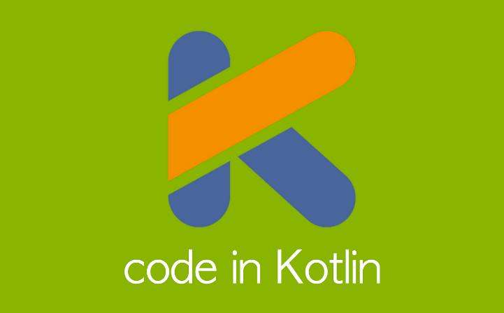
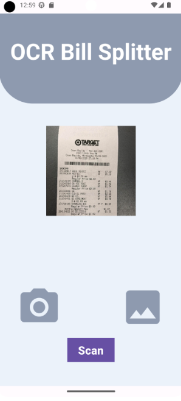

## Introduction
This Android App was developed for my Fall ‘23 Junior Project class at UH Manoa. The total time spent acquiring the adequate knowledge to develop the App plus the time to develop the app spans from that Summer in June to the end of the fall semester in December. This was also a solo project, supplemented by weekly meetings with the professor in charge of the class, Professor Sasaki. The app was designed with the goal of implementing an intermediate programming concept and/or having a moderate impact, the app I chose to develop focusing on the prior. With that being said, my app is named the OCR Bill Splitter App, developed using Kotlin and Android Studio and features machine learning vision as an intermediate programming concept.

## My Design Approach
At the time I was brainstorming app ideas, I was currently dorming in UH Manoa with 3 other roommates, and none of us had meal plans as we were living in a suite and planned to cook our own meals in the kitchen. Throughout the semester, the plan was to also just have one or two people run groceries for everyone as free time to go grocery shopping didn’t come by that often. This meant that one of the people going grocery shopping had to pay for all of our groceries and the three other people had to pay that one guy back, basically splitting the receipt total.  
A problem we encountered from this was we often didn’t trust ourselves to properly split the bill, so we had two or three of us calculating the split to confirm with one another that we performed math correctly which is a mild inconvenience. To aid this, I aimed to create an app where the user inputs the receipt entries with the product name and costs, enters the number of people splitting the bill, and automatically calculates the split. A glorified calculator if anything. Then I thought, if my target is to make the process of splitting a bill as convenient as possible, the next step would be to have an easier way to input all the receipt entries. That’s where ML Vision and OCR come in. 

Once I had a solid idea of the app I wanted to build, I started researching online on existing OCR scanner apps and if there were already receipt scanning and splitting apps on the google play store, just to get an idea of how developers have implemented OCR in their apps and what users of these apps are looking for. Then I started designing the individual components of my app, like the image to text conversion using OCR, splitting up receipt entries into a dynamic list, and the split calculation. Using Kotlin, there weren’t too many up-to-date resources for implementing OCR to scan text, but I found Google’s Firebase ML was the most popular library for ML Vision on Androids. I was able to find tutorials on how to create an image scanning app that were 2 years old, and that provided me the basis I needed to understand how to use Firebase ML Kit and helped me in implementing OCR using up-to-date libraries and functions. The UI design and calculation portions of the app were fairly simple to code, and it was just a matter of putting everything together, which also swift work. It still took two months to get everything working as I was a full-time student, but I still had time to improve my app. 
After I had my first cohesive OCR bill splitting app built, I handed the app out, as well as two other apps OCR bill splitting apps on the Google Playstore, Blititer and Scan & Split. I had those users run through the bill splitting process of each app, and had them state at least one thing they liked and disliked about each app. One big dislike about my app was that my app’s UI looked very cheap and noob-ish, but on the other hand, one big like was that my app had the simplest process out of all the apps I asked them to survey. Simplicity was my main goal, so this was good, even if the other apps had other features that made them stand out. Mine would be quick, simple, and intuitive to use… after I updated the UI of my app. 

Some problems I encountered during the development of this app were getting the OCR component working and implementing custom UI elements, as I revamped my entire app UI, redesigning it from start to finish. As I mentioned earlier, the resources on Firebase ML Text scanning were all outdated, besides Google’s documentation page on their own library. This was the second time I was making the app so I was skipping a lot of corners which may have been the cause of the problems I encountered, and it was when I took a step back and designed individual components to get them working where I started making progress. The requirements of this project are that I use Kotlin however, so figuring out how to utilize another library based only on its documentation was a difficult but practical challenge.
