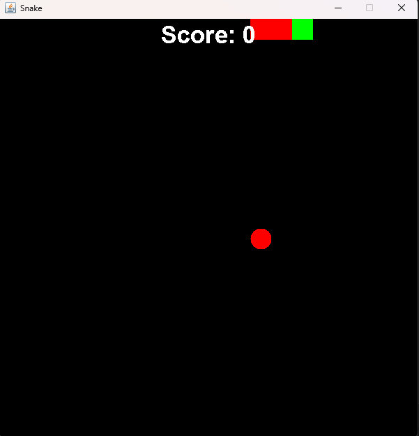

<div class="text-center p-4">
  
  
  
</div>

<hr>

## Introduction
All you need to know about this project is in its title! <br>
I programmed (in Java) the classic "Snake" game, a game featuring a user-controlled snake constanly moving on a grid
whose goal is to eat as many randomly spanwed apples as they can without crashing into the border or itself! <br>
This project was completed over two months and served to cement the content learned throughout the class including but not limited to: <br>
``Object Orientation, GUI, Advanced I/O, Data Structures, and Relational Databases``<br>

Here is an additional snippet of the goal of designing this project.
<pre>
In my project, I will be making a simple snake game which will consist of a window in which the game is played, a snake<br>consisting of square tiles, and a square tile that represents food. The game will be played with the arrow keys. This project<br>will consist of classes with methods that are able to check for collisions, check if the snake has eaten the food that has<br>spawned, spawn new food, and retrieve the location data of the snake as well as create the window in which the game is<br>played. The user will be able to use the arrow keys to control the snake in the direction of the food and the game will halt<br>if it detects a collision, or spawn more food if collision with food has been detected. 
</pre>


## Features
Actual implementation of the previously stated mechanics required the use of the **JPanel** and **JFrame** generic containers from the **Java Swing** package to "draw" each component and provide a window for the game GUI and **Action Listeners** to process user input.<br>
The organization of the code would include three classes: **Main**, **GameFrame**, and a **GamePanel** class.
### Main
The Main class, required of all Java projects at the time this was programmed, contained a main method that opened the pop-up window of the game which.<br>
 This would cause the rest of the game code to trigger.
 ```cpp
 public class Main {
    
    public static void main(String[] args) {

        new GameFrame(); // instantiate new JFrame
    }
}
 ```
### Game Frame
The GameFrame class contained the settings of exclusively the pop-up window of the game, not the actual pixels on the window. Thus the code for this class was also fairly simple.
```cpp
public class GameFrame extends JFrame{
    GameFrame() {
        this.add(new GamePanel());
        this.setTitle("Snake");
        this.setDefaultCloseOperation(JFrame.EXIT_ON_CLOSE);
        this.setResizable(false);
        this.pack();
        this.setVisible(true);
        this.setLocationRelativeTo(null);
    }
}
```

### Game Panel
The GamePanel class contained all the core components for the game run. This includes the updating of all the **UI** of the screen which would display on the window created by the GameFrame class and the **user input handler**. Using the JPanel container, it is possible to "draw" or color in certain pixels on the pop up window. Use of that method allows for easy sync between the constantly updated position of the displayed components.<br>

For example, the position of the snake is stored in two arrays, one each for horizontal and vertical position, which makes it easy to check if the position of the head of the snake interacts with other elements such as the apple or wall.<br>
Inside a separate function, to update the pixels on the GUI, it's very easy to relate the pixels of the game screen with the position of the snake, and use the draw method to reflect the changes of the array variables on the GUI. This makes it so the interactions the program needs to track are handled intuitively using basic data types and comparisons, and the updating of the GUI can be handled in parallel.
```cpp
// Handling of snake element positions
/* Necessary Updates when Moving */
public void move() {
    // Moves Body Parts
    for(int i = bodyParts; i > 0; i--) {
        x[i] = x[i - 1];
        y[i] = y[i - 1];
    }
    // Moves Head
    switch(direction) {
        case 'U':
            y[0] = y[0] - TILE_SIZE;
            break;
        case 'D':
            y[0] = y[0] + TILE_SIZE;
            break;
        case 'L':
            x[0] = x[0] - TILE_SIZE;
            break;
        case 'R':
            x[0] = x[0] + TILE_SIZE;
            break;
    }
}
.
.
.

// Somewhere else in the class, reflecting changes onto GUI
/* Draws on Paint Component */
public void draw(Graphics g) {
    if(inGame) {
        // Apple
        g.setColor(Color.red);
        g.fillOval(appleX, appleY, TILE_SIZE, TILE_SIZE);
        // Snake
        for(int i = 0; i < bodyParts; i++) {
            if(i == 0) {
                g.setColor(Color.green);
                g.fillRect(x[i], y[i], TILE_SIZE, TILE_SIZE);
            }
            else {
                //g.setColor(new Color(random.nextInt(255),random.nextInt(255),random.nextInt(255))); // Rainbow body
                g.setColor(Color.red); // Red body
                g.fillRect(x[i], y[i], TILE_SIZE, TILE_SIZE);
            }
            Toolkit.getDefaultToolkit().sync(); // Syncs Drawing
        }
    .
    . 
    .
```