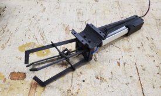
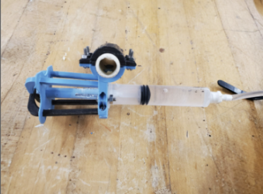

## Introdution
SeaPerch is an underwater ROV competition and community that guides over 250,000 students annually through a real-world engineering and design project [1]. The theme of the 2022 International SeaPerch Challenge was space exploration, taking advantage of the properties of water to simulate  space-like conditions. The tasks our ROV had to complete underwater were also space related. It would be cool if the competition was actually held in outer space though!  

The competition consisted of a challenge course, an obstacle course, a techincal design report, and team video. The challenge course required our ROV to complete four different tasks including rotation and transportation of different objects across various platforms elevated above the pool floor. 
A more in-depth overview of the pool competition courses can be found below.

<pre>
The SeaPerch pool competition is divided up into the mission course and obstacle course. The first is the obstacle course which consists of five hoops that require the driver to precisely navigate the ROV through in order, starting with the hoop closest to the wall. Once the ROV has passed through the fifth and furthest hoop, it must surface the water before retracing its path, going back through the hoops in reverse order. The mission course consists of four separate tasks. The first of which, opening the battery panel, requires a latch to be rotated for the panel to be pushed or pulled open and must be completed first to gain access to the battery compartment. The second task involves disconnecting the power cables from the batteries in the battery compartment without applying force to the batteries. The third task is to replace the batteries in the battery compartment with the batteries in the adjacent battery pallet. The fourth task requires the ROV to transport tools from the Extra Vehicular Activity(EVA) tool tray to the tool caddy. All four of these tasks must be completed within 13 minutes. 
</pre>

[1] Read more about SeaPerch [here](https://seaperch.org/about/)!

## My Role
I participated in SeaPerch while I was a student at James B. Castle High School from 2020-2022 with their robotics team the ProtoKnights. I was the lead CAD engineer during my junior year and during my senior year I was assigned to be a team lead and shroud designer. I will specifcally be talking about our team's accomplishments during my senior year. 

While I was the team lead,  I oversaw the design process of all components of our ROV, Proto-E, named after Disney's WALL-E. Fittingly so, as our ROV exceeded at latter tasks of the space-themed challenge course, the last of which was to transport tools from the extra vehicular activity, shortened to EVA, tray. In the WALL-E movie, EVA was how WALL-E frequently mispronounced their romantic partner's name EVE.  

Our ROV, Proto-E, was designed prioritizing maunverability, as speed is key in both pool courses, and object manipulation abilities, having to rotate, push, pull, and transport objects over open space. This being the conclusion our team came to at the start of the season. With that general concesus, I provided the team's newer members with knowledge from previous seasons, including my experiences and observations of the performance of those ROV designs. By pointing out the designs' strengths and weakness, I believed it would lay a foundation for innovative thinking and improved designs in our new member's brains, letting their creativity get to work while I round down their imagination or encourage more ambition, to fit into or make full use of our design constraints. 

  

I believe one particular design had the wildest roller coaster ride of **all** my prior experience with engineering, that being the design of our claw manipulator. One of the team members suggested we use a motor-powered linear actuator instead of a hydraulic line to open and close our claw, as hydraulics required high maintanence for consistent repitive motion, which even with proper maintanence still resulted in incosistencies which counteracted the muscle memory of our drivers. With a linear actuator, the claw would be remotely activated, resulting in less mass of the tether which included the power line for the motors and hydraulic line, and be more consistent than the hydraulic line as the range of the motor would staty the same whereas air getting into the hydraulic system would reduced range of motion. 
 

  
  

The only downside is figuring out how to fully waterproof the claw, which proved much more difficult than it sounded. Up until the day of regional competition, where we have to earn our ticket to internationals, the waterproofing proved inconsistent and the lives of many motors were lost. Due to the rush, the last motors were poorly waterproofed and would short out almost immediately on the day prior to competition, so I had to last-minute design a static 3D-printed piece that would be able perform the same tasks I had practitced completing with the electronic actuated-claw. Needless to say, we still punched our ticket to international competition and were disciplined heavily afterwards and had the claw design translated to use hydraulics and placed third overall at internationals with the final design. 
As the team lead, I should've weighed the risks and time constraints of this design approach and establish a stricter timeline and back-up plans knowing the deadlines we were up against. On the other hand, part of me is glad to have that experience and in letting my team member pursue a difficult design which I assessed to be truly achievaable and a huge improvement to prior designs, especially with how much effort that member was putting into it. If I were to encounter this situation again in the future, I would handle it differently. I would probably assign a second member to maintain a hydraulic version of the claw design and update it alongside the electronic version depending on the resources were available and establish better communication so a back-up plan and when it should become the main plan was clear.
