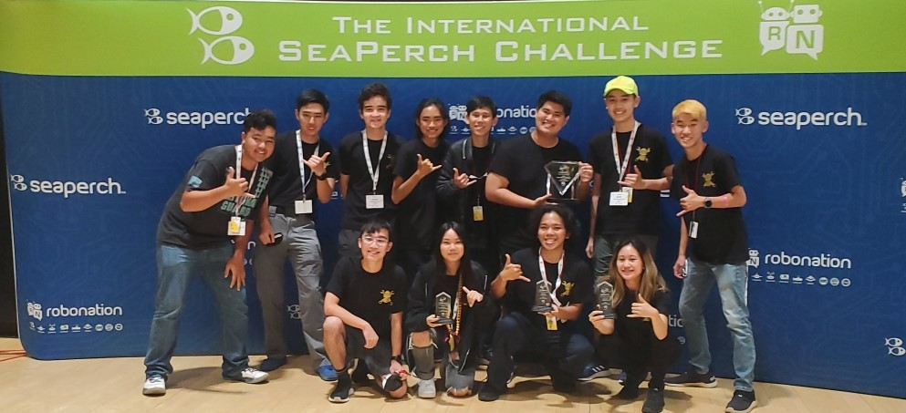

SeaPerch is an underwater ROV competition and community that guides over 250,000 students annually through a real-world engineering and design project [1]. 

The competition consisted of a challenge course, an obstacle course, a techincal design report, and team video. 
The challenge course required our ROV to complete four different tasks including rotation and transportation of different objects across various platforms elevated above the pool floor.

I participated in SeaPerch while I was a student at James B. Castle High School from 2020-2022 with their robotics team the ProtoKnights.
During my senior year I was assigned to be a team lead and shroud designer. During this time I oversaw the design process of our ROV, Proto-E, named after Disney's WALL-E

[1] Read more about SeaPerch [here](https://seaperch.org/about/)!
